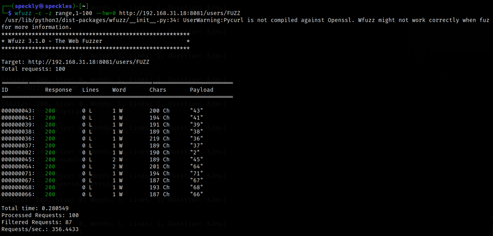
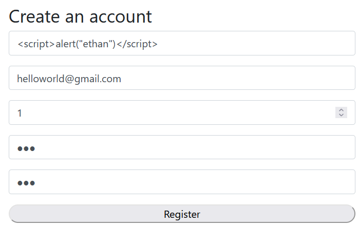
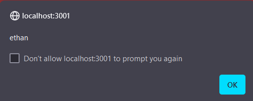
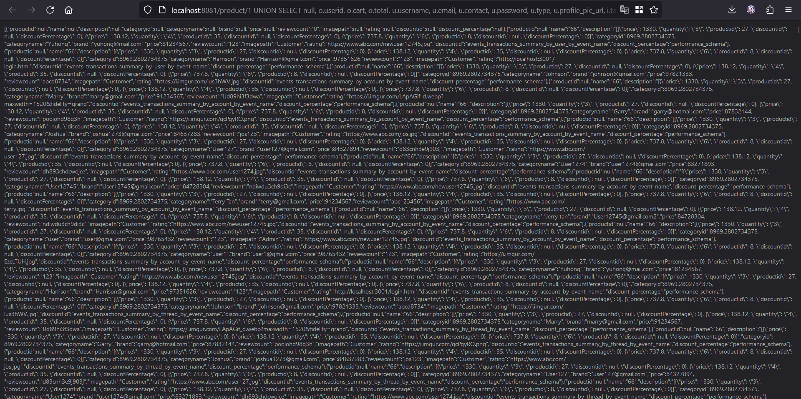
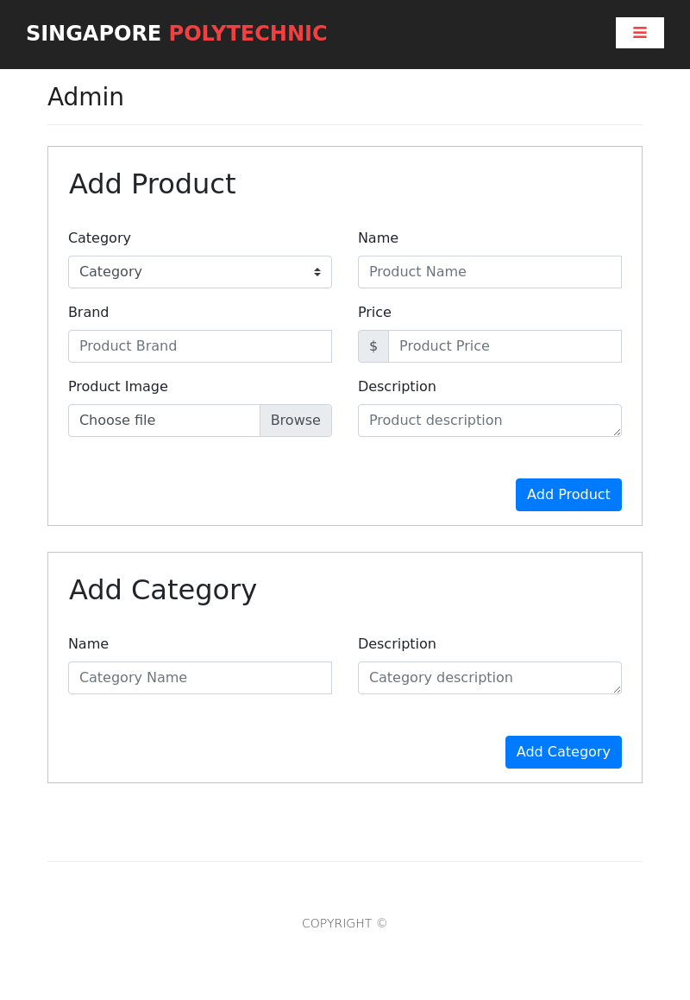

# ST2515: Secure Coding 2023/2024 Semester 2 Assignment 1
Application of code analysis and web penetration skills to ensure secure coding practices in a web project. The provided web project contains source codes that require thorough analysis. The task is to deploy and test the web application, review its source codes, and identify any potential security vulnerabilities.
> [!WARNING]
> This repository is created only for learning purpose. Do not deploy to a live server as there are vulnerabilities in both applications (i was not paid enough to fix everything)

# Usage

If you are running the patched application, in the root folder, create two files ```cert.pem``` and ```key.pem```
```bash
openssl req -x509 -newkey rsa:4096 -keyout key.pem -out cert.pem -days 365
```
These two files are secret and therefore should never be shared out. These files are not required for the vulnerable application.
To run the vulnerable application, ```./Legacy/start.bat```
To run the patched application, ```./start.bat```

# Summary
This application hardening exercise makes of a selection of 5 categories of OWASP TOP 10 2021 to audit.

### [A01 Broken Access Control](https://owasp.org/Top10/A02_2021-Cryptographic_Failures/)
[Detailed](#10-get-users): No access control put in place for [endpoint 10](#10-get-users), any requests, with or without token can get personal information from this endpoint
Demo: 
```bash
python ./exploit_demos/user_data.py
```
Vulnerability is missing middleware responsible for access control: 
```js
app.get("/users", (req, res) => {});
```
Resolution:
```js
function verifyTokenAdmin(req, res, next) {
    // ... Pre-processing

    jwt.verify(token, config.getCurrentKey(), function (err, decoded) { 
        if (err || decoded.type != 'Admin') { // Add another condition: if not admin, reject with HTTP 403
            res.status(403);
            return res.json({ auth: false, message: 'Not authorized!' });
        } else { // This means that type is verified to be admin
            req.userid = decoded.userid;
            req.type = decoded.type;
            next();
        }
    });
}
```

[Brief](#adminhtml): Allowing of forced browsing to access [admin.html](#adminhtml), the page is served but shortly redirected back to landing page on authentication failure. This authentication is done on the client side which is a poor choice as clients can avoid execution of this code.
Vulnerability seen on client side:
```js
if (data) {
    let { userid, type } = data
    if (type.toLowerCase() != "admin")
    window.location.assign("http://localhost:3001/index.html")
}
```
Demo: 
```bash
python ./exploit_demos/admin.py
```
```bash
cutycapt --url=http://$HOSTNAME:3001/admin.html --delay=200 --out=admin200.png
```
Resolution:
```js
// FrontEnd/server.js
// Serve admin.html only if the admin token is valid

app.use('/admin', verifyTokenAdmin, (req, res) => {
    res.sendFile(__dirname + "/public/admin/admin.html");
});

app.use(serveStatic(__dirname + "/public"));
```

### [A02 Cryptographic failure](https://owasp.org/Top10/A02_2021-Cryptographic_Failures/)
[Detailed](#network-protocol): Uses HTTP protocol and is susceptible to MITM or session hijacking
Demo: Use Wireshark
Vuln: Missing HTTPS implementation
Resolution:
```bash
openssl req -x509 -newkey rsa:4096 -keyout key.pem -out cert.pem -days 365
```
```js
const express = require('express');
const https = require('https');
const fs = require('fs');

const app = express();
const httpPort = 3001;
const httpsPort = 3002;

// Middleware to redirect HTTP to HTTPS
app.use((req, res, next) => {
    if (!req.secure) {
        url_https = `https://${req.headers.host.replace(/:\d+$/, `:${httpsPort}`)}${req.url}`
        console.log(url_https)
        return res.redirect(url_https);
    }
    next();
});

const options = {
    key: fs.readFileSync('key.pem'),
    cert: fs.readFileSync('cert.pem'),
};

const server = https.createServer(options, app);
server.listen(httpsPort, () => {
    console.log(`HTTPS server hosted at https://${HOSTNAME}:${httpsPort}`);
});

// Create HTTP server for redirection
const httpServer = express();
httpServer.use((req, res) => {
    url_https = `https://${req.headers.host.replace(/:\d+$/, `:${httpsPort}`)}${req.url}`
    return res.redirect(url_https);
});

httpServer.listen(httpPort, () => {
    console.log(`HTTP server hosted at http://${HOSTNAME}:${httpPort}`);
});
```

[Brief](#cryptography): No key rotation is implemented
Vuln:
```js
var secret = '89f48478ofu84hfue8o8eije4';
module.exports.key = secret;

```
Resolution:
```js
// ./BackEnd/config.js

const crypto = require('crypto');
const fs = require('fs');

const keyFilePath = './secretKey.txt';

function generateRandomKey(length) {
    const buffer = crypto.randomBytes(length);
    return buffer.toString('base64');
}

const rotationPeriodDays = 90;
let lastRotationDate;
let secret;

function rotateKeyIfNeeded() {
    const now = new Date();
    const rotationThreshold = new Date(lastRotationDate.getTime() + rotationPeriodDays * 24 * 60 * 60 * 1000);

    if (!lastRotationDate || now >= rotationThreshold) {
        secret = generateRandomKey(32);
        lastRotationDate = now;
        const content = JSON.stringify({ secret, lastRotationDate });
        fs.writeFileSync(keyFilePath, content, 'utf-8');
    }
}

function getCurrentKey() {
    if (!secret || !lastRotationDate) {
        try {
            const content = fs.readFileSync(keyFilePath, 'utf-8');
            const data = JSON.parse(content);
            secret = String(data.secret);
            lastRotationDate = new Date(data.lastRotationDate);
        } catch (error) {
            // If the file doesn't exist or there's an error reading it, generate a new key and store
            secret = generateRandomKey(32);
            lastRotationDate = new Date();
            const content = JSON.stringify({ secret, lastRotationDate });
            fs.writeFileSync(keyFilePath, content, 'utf-8');
        }
    }

    rotateKeyIfNeeded();
    return secret;
}

module.exports.getCurrentKey = getCurrentKey;
```

### [A03 Injection](https://owasp.org/Top10/A03_2021-Injection/)
[Detailed](#16-get-productid): SQLi injection, endpoint 16 allows complete database dump, endpoint 5 allows code injection to allow deletion of reviews, endpoint 18 allows, code injection but has a low impact
**Injectable parameter in GET /product/:id**
```js
dbConn.query( `select p.productid, p.name, p.description, c.categoryid, category categoryname, p.brand, p.price, COUNT(distinct r.reviewid) reviewcount, pi.path imagepath, AVG( r.rating) rating, d.discountid, d.discount_percentage from product p join category c on c.categoryid = p.categoryid left join reviews r on r.productid = p.productid left join productimages pi on pi.productid = p.productid left join discount d on d.productid = p.productid 
where p.productid = ${productid} GROUP BY p.productid`, [], function (err, results) dbConn.end();, (err, result) => {})
```
Demo: 
```sql
1 UNION SELECT null, o.userid, o.cart, o.total, u.username, u.email, u.contact, u.password, u.type, u.profile_pic_url, i.table_name, i.table_schema FROM user u, INFORMATION_SCHEMA.TABLES i, orders o UNION SELECT null, null, null, null, null, null, null, null, null, p.productid, null, null FROM product p
```
[click here for free data!!!](http://localhost:8081/product/1%20UNION%20SELECT%20null,%20o.userid,%20o.cart,%20o.total,%20u.username,%20u.email,%20u.contact,%20u.password,%20u.type,%20u.profile_pic_url,%20i.table_name,%20i.table_schema%20FROM%20user%20u,%20INFORMATION_SCHEMA.TABLES%20i,%20orders%20o%20UNION%20SELECT%20null,%20null,%20null,%20null,%20null,%20null,%20null,%20null,%20null,%20p.productid,%20null,%20null%20FROM%20product%20p)

Resolution:
```js
dbConn.query(
    `insert into product 
    (name, description, categoryid, brand, price)
    values(?, ?, ?, ?, ?);`,
    [name, description, categoryid, brand, price]
)
```
[Brief](#9-post-users): Inserted data is not validated, resulting in stored XSS, Endpoint 3, 9, 18
No vulnerable code, there is just a lack of validation
Demo: Attempt from 
```
http://localhost:3001/register.html
```
Register a user with username as a HTML inline script then post a review
Resolution:
```js
const createDOMPurify = require('dompurify');
const { JSDOM } = require('jsdom');

const window = new JSDOM('').window;
const DOMPurify = createDOMPurify(window);

app.post("/order", verifyToken, (req, res) => {
    const { cart, total } = req.body;

    const sanitizedCart = DOMPurify.sanitize(cart);
    const sanitizedTotal = DOMPurify.sanitize(total);
    // ...
});
```

Extra: No output sanitisation resulting in existing stored XSS displaying
Status: Unresolved because I was paid to only find two vulnerabilities per category
### [A04 Insecure Design]()
[Detailed](#4-put-productproductid): Insecure token validation middleware does not deny access to sensitive endpoints that require admin tokens. Any request with a valid token can access these endpoints. Endpoint 3 (Operation Disruption), 4 (Data integrity), 5 (Partial DoS), 12 (User data integrity), 13 (low impact if not displayed), 15 (XSS), 17 (DoS), 23 (image integrity)
Vuln is that ```verifyToken``` is **does not provide not enough security**:
```js
app.put("/product/:productid", verifyToken, (req, res) =>{})
```
Demo on endpoint 4: 
```bash
python ./exploit_demos/update_product.py
```
Resolution is to add more security to the middleware:
```js
function verifyTokenAdmin(req, res, next) {
    // Pre-processing
    jwt.verify(token, config.getCurrentKey(), function (err, decoded) { 
        if (err || decoded.type != 'Admin') { // Add another condition: if not admin, reject with HTTP 403
            res.status(403);
            return res.json({ auth: false, message: 'Not authorized!' });
        } else { // This means that type is verified to be admin
            req.userid = decoded.userid;
            req.type = decoded.type;
            next();
        }
    });
}
```

[Brief](#11-get-usersid): Endpoint 11 accepts requests from anyone regardless of userid, and through incremental guessing, attackers can get user information
Demo: 
```bash
python ./exploit_demos/user_data.py
```
```bash
wfuzz -c -z range,1-100 --hw=0 http://$HOSTNAME:8081/users/FUZZ
```

Resolution: on server side check the user's token and decode it, and only use the userid that is provided in the user token. The parameter field can be modified and therefore cannot be trusted
```js
// ./FrontEnd/public/userprofile.html

var token = localStorage.getItem("JWT");
    var userInfo = localStorage.getItem("User")
    let userId = -1

    function editUser() {
        axios.get(`http://localhost:8081/users/${userId}`, {
            headers: { 'authorization': 'Bearer ' + token }
        })
        // ...
    }
```
### [A07 Identification and Authentication failures]() 
[Detailed](#8-post-userlogin): Endpoint 8 allows brute forced or automated attacks, which can lead to privilege escalation
Demo:
Hackers can spam click login buttons and view Network panel in the browser of their choice to discover that the backend has no limits to how much attackers can guess passwords. Demo: 
```bash
python ./exploit_demos/privilege_escalation.py
```
Resolution:
```bash
npm install express-rate-limit
```
```js
// ./BackEnd/app.js
const express = require('express');
const rateLimit = require('express-rate-limit');

const app = express();

const password_limiter = rateLimit({
    windowMs: 5 * 60 * 1000, // 10 minutes
    max: 5, // 5 reqs per 10 minutes
});

app.post("/user/login", password_limiter, function (req, res) {})
```
[Brief](#9-post-users): Endpoint 9 does not enforce any password policies, which can also lead to privilege escalation, even if cryptography is applied
Demo, see that both weak password policy and lack of rate limiting contributes:
```bash
python ./exploit_demos/privilege_escalation.py
```
To implement a password policy
```js
const passwordValidator = /^(?=.*[A-Za-z])(?=.*\d)[A-Za-z\d]{8,}$/;

if (!passwordValidator.test(password)) {
    return res.status(422).json({
        message: "Password must contain at least 8 characters, including one letter and one digit.",
    });
}
```
## Endpoints

### 1. POST /user/isloggedin
Only some if statements to check data, no RWX operations,all good
### 2. GET /order/:userid
Based on req.userid SELECT, SQL is prepared, all good
### 3. POST /order
##### Status:
> [!NOTE] Optional chaining 
```
object?.property
``` 
This operator allows you to safely access properties of an object without causing an error if the object is null or undefined. 

SELECT, INSERT, both prepared. 

> :fire: **Critical:** A3 (detailed): Inserted data is not validated, and html elements can be stored in database, potentially resulting in stored XSS
See endpoint 9 A3 (detailed)

### 4. PUT /product/:productid
##### Status:
> :fire: **Critical** A4 (detailed): This is a highly sensitive endpoint that only users with the highest privilege should access. It has been found that all users with a valid token can successfully make a request to this endpoint

Exploit demo: 
```bash
python ./exploit_demos/update_product.py
```

Resolution, create another middleware function to validate an admin token (can just add a bool parameter to switch mode in verifytoken but a lot of calling changes)
```js
function verifyTokenAdmin(req, res, next) {
    var token = req.headers['authorization']; 

    if (!token || !token.includes('Bearer')) { 
        res.status(403);
		return res.send({ auth: 'false', message: 'Not authorized!' });
    } else {
        token = token.split('Bearer ')[1];
        jwt.verify(token, config.key, function (err, decoded) { 
            if (err || decoded.type != 'Admin') { // Add another condition: if not admin, HTTP 403
                res.status(403);
                return res.json({ auth: false, message: 'Not authorized!' });
            } else {
                req.userid = decoded.userid; //decode the userid and store in req for use
                req.type = decoded.type; //decode the role and store in req for use
                next();
            }
        });
    }
}
```

### 5. DELETE /review/:reviewid
##### Status:
> :fire: **Critical:** A3 (detailed, continued): SQLi 

> [!WARNING] 
> A4 (detailed, continued): Similar. The impact of this broken access is that any user's reviews can be deleted

Review id:
```sql
8 OR 1=1
```

User id is decoded using JWT, unless the JWT can be forged, the user id cannot be changed. Therefore the risk is somewhat low as the maximum risk is the user deleting all of their own reviews

### 12. PUT /users/:id
##### Status:
> :warning: **Warning:**: A4 (detailed): This endpoint can accept requests from anyone with a valid token, while this endpoint was intended only for admins to use. Risk is high as other users can modify other user's information, including passwords

### 13. POST /category
##### Status:
> :warning: **Warning:**: A4 (detailed): This endpoint can accept requests from anyone with a valid token, while this endpoint was intended only for admins to use. Risk is high as categories can be added and lead to XSS if they are displayed otherwise the risk is low

### 15. POST /product
##### Status:
> :warning: **Warning:**: A4 (detailed): This endpoint can accept requests from anyone with a valid token, while this endpoint was intended only for admins to use. Risk is high as registered users can post new products

### 17. DELETE /product/:id
##### Status:
> :fire: **Critical:**: A4 (detailed): This endpoint can accept requests from anyone with a valid token, while this endpoint was intended only for admins to use. Risk is critical as registered users can delete products and risk the availability and all incoming business operations

### 18. POST /product/:id/review
##### Status:
> :fire: **Critical:** A3 (detailed): Inserted data is not validated, and html elements can be stored in database, potentially resulting in stored XSS
See Endpoint 9 A3 (brief)
> [!Warning] 
> A3 (brief3): SQLi. Has low risk due to nature of SQL statement.

### 20. POST /discount/:productid
Validated admin token this time.

### 23. POST /product/:id/image
##### Status:
> :warning: **Warning:**: A4 (detailed): This endpoint can accept requests from anyone with a valid token, while this endpoint was intended only for admins to use.

### Without verifyToken middleware

### 6. GET /product/brand/:brand
Looks good, viewing by brand is not sensitive

### 7. GET /product
Looks good, products are public view

### 8. POST /user/login
##### Status:
Has no token verification as this is to login. 

> :fire: **Critical** A7 (brief): Permits brute force or other automated attacks due to a lack of rate-limiting. Can lead to privilege escalation. Brute force success chance is also lowered due to weak password policy. See Endpoint 9 A7

Demo:
```bash
python ./exploit_demos/privilege_escalation.py
```
Resolution by adding a rate limiter middleware
```bash
npm install express-rate-limit
```
```js
// ./BackEnd/app.js
const express = require('express');
const rateLimit = require('express-rate-limit');

const app = express();

const password_limiter = rateLimit({
    windowMs: 5 * 60 * 1000, // 10 minutes
    max: 5, // 5 reqs per 10 minutes
});

app.post("/user/login", password_limiter, function (req, res) {})
```

### 9. POST /users
##### Status:

> :warning: **Warning:** A7 (extra): No password hashing is implemented here

> :fire: **Critical:** A3 (detailed, continued): Inserted data is not validated, and html elements can be stored in the database, potentially resulting in stored XSS. This username is displayed when the reviews pull the name and browser reflects it without output sanitization

Demo: Visit ```http://localhost:3001/register.html```
Create a user with a username of a XSS payload

Insert a review as the user and refresh the page. The review will be displayed, including the username


Resolutions: 
1. Whitelist input, escape them from html characters and sanitise output in endpoints where it returns stored data. Can use the [Validator](https://www.npmjs.com/package/validator) module
```js
const validator = require('validator');

//...
if (!validator.isEmail(email)) {
    res.status(422).json({ message: "Invalid email address" });
    return;
}
```
2 (implemented). Input sanitisation, it is easier to implement as whitelisting will result in input being rejected and giving us extra work on the front end. Input sanitisation provides the same mitigation against a XSS attack:
```js
const createDOMPurify = require('dompurify');
const { JSDOM } = require('jsdom');

const window = new JSDOM('').window;
const DOMPurify = createDOMPurify(window);

app.post("/order", verifyToken, (req, res) => {
    const { cart, total } = req.body;

    const sanitizedCart = DOMPurify.sanitize(cart);
    const sanitizedTotal = DOMPurify.sanitize(total);
    // ...
});
```

> :warning: **Warning:** A7 (detailed): No password policy is enforced, even if hashing (currently not implemented, see Cryptography section below) is implemented, the passwords can be cracked through rainbow tables. Another risk is the increased chance of a brute force attack if users use common passwords. See Endpoint 8 A7

Demo:
```bash
python ./exploit_demos/privilege_escalation.py
```

To implement a password policy
```js
const passwordValidator = /^(?=.*[A-Za-z])(?=.*\d)[A-Za-z\d]{8,}$/;

if (!passwordValidator.test(password)) {
    return res.status(422).json({
        message: "Password must contain at least 8 characters, including one letter and one digit.",
    });
}
```

### 10. GET /users
##### Status: Resolved

> :fire: **Critical:** A1 (detailed, this doesnt have any middleware): This endpoint has no user validation, therefore anyone can view all users as long as they make a request to this endpoint. This exposes userid, username, email, contact, type, profile_pic_url, created_at. These even include the admin users and result in vertical privilege escalation.


Resolution, create another middleware function to validate an admin token, see Endpoint 4 A1

### 11. GET /users/:id
##### Status: Resolved
> :warning: **Warning:**: A4 (brief): Since this endpoint can accept requests from anyone regardless of their userid, users can request for the user data of other users. Malicious threat actors can steal user data by making continuous requests to this endpoint and incrementing their id argument by 1 for each request.

> [!INFORMATION]
> 2021:A04 - An insecure design cannot be fixed by a perfect implementation as by definition, needed security controls were never created to defend against specific attacks. This endpoint only contains the verifytoken middleware but it is not sufficient.

Exploit demo: 
```bash
python ./exploit_demos/user_data.py
```

```bash
wfuzz -c -z range,1-100 --hw=0 http://$HOSTNAME:8081/users/FUZZ
```


Resolution: on server side check the user's token and decode it, and only use the userid that is provided in the user token. The parameter field can be modified and therefore cannot be trusted

We see that the JWT token has already been included in the request so therefore no additions are needed for front end. However it would be useful if we removed the workflow of getting the userid from the local storage as we have decided that we would not trust the userid URL parameter, therefore this step would be rendered useless 
```js
// ./FrontEnd/public/userprofile.html

var token = localStorage.getItem("JWT");
    var userInfo = localStorage.getItem("User")
    let userId = -1

    function editUser() {
        axios.get(`http://localhost:8081/users/${userId}`, {
            headers: { 'authorization': 'Bearer ' + token }
        })
        // ...
    }
```

On the server side, we should check if the token is valid by simply adding the existing middleware to verify that any decoded data can be trusted and use only the userid from decoding this
```js
var verifyToken = require("../auth/verifyToken.js");

app.get("/users/:id", verifyToken, (req, res) => {
    // req.userid = decoded.userid
    userDB.getUser(req.userid, (err, results) => {});
});
```
### 14. GET /category
### 16. GET /product/:id

> :fire: **Critical:** A3 (brief): SQLi. The risk is the confidientiality of all information stored in the store's MySQL instance

[Now, that's a lot of damage!](http://localhost:8081/product/1%20UNION%20SELECT%20null,%20o.userid,%20o.cart,%20o.total,%20u.username,%20u.email,%20u.contact,%20u.password,%20u.type,%20u.profile_pic_url,%20i.table_name,%20i.table_schema%20FROM%20user%20u,%20INFORMATION_SCHEMA.TABLES%20i,%20orders%20o%20UNION%20SELECT%20null,%20null,%20null,%20null,%20null,%20null,%20null,%20null,%20null,%20p.productid,%20null,%20null%20FROM%20product%20p)

```sql
1 UNION SELECT null, o.userid, o.cart, o.total, u.username, u.email, u.contact, u.password, u.type, u.profile_pic_url, i.table_name, i.table_schema FROM user u, INFORMATION_SCHEMA.TABLES i, orders o UNION SELECT null, null, null, null, null, null, null, null, null, p.productid, null, null FROM product p
```

Resolution is to use placeholders
```js
// ./BackEnd/models/product.js
getProduct: (productid, callback) => {
    var dbConn = db.getConnection();
    dbConn.connect(function (err) {
        if (err) {
            return callback(err, null);
        } else {
            dbConn.query(
                `select p.productid, p.name, p.description, c.categoryid, category categoryname, p.brand, 
                p.price, COUNT(distinct r.reviewid) reviewcount, 
                pi.path imagepath, AVG( r.rating) rating, d.discountid, d.discount_percentage 
                from product p join category c on c.categoryid = p.categoryid  
                left join reviews r on r.productid = p.productid
                left join productimages pi on pi.productid = p.productid 
                left join discount d on d.productid = p.productid 
                where p.productid = ?
                GROUP BY p.productid`, [productid], 
                function (err, results) {
                    // ...
                }
            );
        }
    });
},
```

### 19. GET /product/:id/reviews 21. GET /discount 22. GET /discount/:id 24. GET /product/:id/image 25. GET /product/cheapest/:categoryid
##### Status:
> [!WARNING]
> A3 (extra): No output sanitisation, risk is displaying stored XSS

Unsure of the use for endpoint 25

# admin.html 
##### Status: Resolved
> [!WARNING]
> A1 (brief): admin.html is protected by an inline script, however it exposes some admin endpoints as users can capture the page source and even render it. These admin endpoints should therefore not overlook any security

To view the admin page before it redirects
```bash
cutycapt --url=http://$HOSTNAME:3001/admin.html --delay=200 --out=admin200.png
```


To view the admin page source code to view endpoints. Here we use the requests module from python as we are only interested in reading the raw HTML source. Using a browser will execute it and therefore redirect us to the front page as we are not authenticated as an administrator
```bash
python ./exploit_demos/admin.py
```

The resolution is to validate an admin token to determine access rights in the backend instead of the frontend.
See Endpoint 4 A1 for ```verifyTokenAdmin``` middleware function
```js
// FrontEnd/server.js
// Serve admin.html only if the admin token is valid

app.use('/admin', verifyTokenAdmin, (req, res) => {
    res.sendFile(__dirname + "/public/admin/admin.html");
});

app.use(serveStatic(__dirname + "/public"));
```

Modify frontend on each page to dynamically include token when admins click on the button. Here we removed the href redirecting to HOSTNAME/admin.html. The script makes a GET request with the stored JWT token and if the backend validates the token to belong to an admin then it sends the admin.html file. frontend will handle it and replace HTML document with the admin.html file. 
```html
<a class="nav-link" href="#" id="login_admin">Admin</a>

<script>
document.getElementById('login_admin').addEventListener('click', function() {
    const token = localStorage.getItem('JWT');
    if (token) {
        const headers = { 'Authorization': 'Bearer ' + token };
        fetch('admin.html', {
            method: 'GET',
            headers: headers,
        }).then(response => {
            window.location.href = 'admin.html';
        }).catch(error => {
            console.error('Error:', error);
        });
    } else { // Case where users try to be funny and unhide the admin button, without a token
        window.location.href = 'login.html';
    }
});
</script>

```
## Cryptography 
> :warning: **Caution:** A7 (extra): All passwords stored in the mySQL instance are not hashed
Also related to A2: Cryptographic Failure, however according to [examples in A7](https://owasp.org/Top10/A07_2021-Identification_and_Authentication_Failures#Description), this vulnerability should be classified as A7. Modifications are required to workflows that handle passwords.

> :warning: **Caution:** A2: Weak cryptographic key used for signing JWT tokens. The current configuration is that its value remains the same forever
#### Status: Resolved

This poses the following risks:
1. Increased Exposure to Compromise: Over time, cryptographic algorithms and key lengths may become vulnerable to attacks due to advancements in computing power and cryptographic analysis. If keys are not rotated regularly, the risk of compromise increases as attackers have more time to exploit weaknesses.
2. Long-term Exposure to Stolen Keys: If a key is compromised or accidentally exposed, not rotating the key means that the compromised key can be used to access sensitive data indefinitely. Key rotation limits the window of opportunity for attackers to misuse a stolen key.
3. Compliance Issues: Many regulatory standards and compliance frameworks require organisations to implement key management practices, including key rotation. Failure to comply with these standards can result in legal consequences, fines, or the loss of business certifications.

The solution is to export the variable secret as the return of a function that checks if it has been 90 days since the last key rotation based on a stored date, this function will return the current key being used for signing the JWT if the key has not expired. If it has expired, the function will destroy the current key, update the date of last key rotation and then replace the current key with a newly generated key, then also returns the newly generated key. HS256 is the [default algorithm](https://github.com/auth0/node-jsonwebtoken#user-content-usage) used by the JWT token signing function, and therefore we should use a key length of 32 bytes. 
> [!NOTE] The key is now stored in ./secretKey.txt so please protect this secret ie. configure OS-level permissions, add to .gitignore
```js
// ./BackEnd/config.js

const crypto = require('crypto');
const fs = require('fs');

const keyFilePath = './secretKey.txt';

function generateRandomKey(length) {
    const buffer = crypto.randomBytes(length);
    return buffer.toString('base64');
}

const rotationPeriodDays = 90;
let lastRotationDate;
let secret;

function rotateKeyIfNeeded() {
    const now = new Date();
    const rotationThreshold = new Date(lastRotationDate.getTime() + rotationPeriodDays * 24 * 60 * 60 * 1000);

    if (!lastRotationDate || now >= rotationThreshold) {
        secret = generateRandomKey(32);
        lastRotationDate = now;
        const content = JSON.stringify({ secret, lastRotationDate });
        fs.writeFileSync(keyFilePath, content, 'utf-8');
    }
}

function getCurrentKey() {
    if (!secret || !lastRotationDate) {
        try {
            const content = fs.readFileSync(keyFilePath, 'utf-8');
            const data = JSON.parse(content);
            secret = String(data.secret);
            lastRotationDate = new Date(data.lastRotationDate);
        } catch (error) {
            // If the file doesn't exist or there's an error reading it, generate a new key and store
            secret = generateRandomKey(32);
            lastRotationDate = new Date();
            const content = JSON.stringify({ secret, lastRotationDate });
            fs.writeFileSync(keyFilePath, content, 'utf-8');
        }
    }

    rotateKeyIfNeeded();
    return secret;
}

module.exports.getCurrentKey = getCurrentKey;
```
# Network Protocol
> :warning: **Caution:** A2 (brief): Uses HTTP protocol and is susceptible to MITM or session hijacking
Using Wireshark, we can view packets on the same network and then steal this JWT token

> [!INFORMATION] 
> This fix may throw a [Mixed Content](https://developer.mozilla.org/en-US/docs/Web/Security/Mixed_content) Error depending on the browser used as backend is in HTTP and frontend is in HTTPS. For demonstration purposes, this protection is turned off

Resolution, transition from HTTP to HTTPS by including a self signed certificate and updating the server configurations for both frontend and backend, and redirect HTTP port to HTTPS port:
To create the certificate:
```bash
openssl req -x509 -newkey rsa:4096 -keyout key.pem -out cert.pem -days 365
```
Then update server configurations and redirect
```js
const express = require('express');
const https = require('https');
const fs = require('fs');

const app = express();
const httpPort = 3001;
const httpsPort = 3002;

// Middleware to redirect HTTP to HTTPS
app.use((req, res, next) => {
    if (!req.secure) {
        url_https = `https://${req.headers.host.replace(/:\d+$/, `:${httpsPort}`)}${req.url}`
        console.log(url_https)
        return res.redirect(url_https);
    }
    next();
});

const options = {
    key: fs.readFileSync('key.pem'),
    cert: fs.readFileSync('cert.pem'),
};

const server = https.createServer(options, app);
server.listen(httpsPort, () => {
    console.log(`HTTPS server hosted at https://${HOSTNAME}:${httpsPort}`);
});

// Create HTTP server for redirection
const httpServer = express();
httpServer.use((req, res) => {
    url_https = `https://${req.headers.host.replace(/:\d+$/, `:${httpsPort}`)}${req.url}`
    return res.redirect(url_https);
});

httpServer.listen(httpPort, () => {
    console.log(`HTTP server hosted at http://${HOSTNAME}:${httpPort}`);
});
```


# Minor modifications
Commented out the hiding of logout container as it is needed for users to clear their local storage. It will happen when keys rotate and user tokens are thus invalidated
```js
$.ajax({
    headers: { "authorization": "Bearer " + token },
    url: "http://localhost:8081/user/isloggedin",
    success: function (data, textStatus, xhr) {

    },
    error: function (xhr, textStatus, errorThrown) {
        $("#userprofile").hide()
        $("#logincontainer").hide()
        // $("#logoutcontainer").hide()
        $("#admin").hide()
    }
})
```
Removed preloader in admin.html as this is now replacing the HTML content of any page and the preloader will only block the content
```html
<!-- ***** Preloader Start ***** -->
  <div id="preloader">
    <div class="jumper">
      <div></div>
      <div></div>
      <div></div>
    </div>
  </div>
  <!-- ***** Preloader End ***** -->
```

In ```./FrontEnd/public/```
Replaced all occurrences of "http://localhost:3001" to "https://localhost:3002"